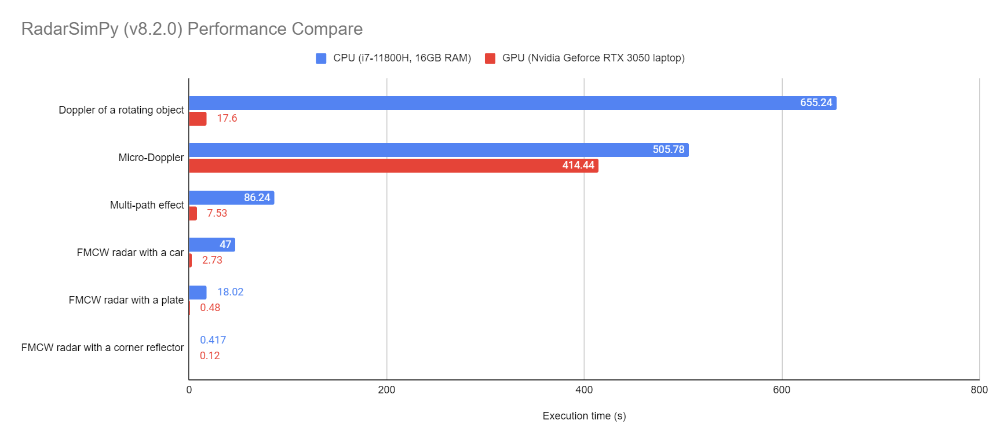

**`!!! This module needs to be built/used together with RadarSimC (the C++ engine for radar simulator)`**

# RadarSimPy

A **Radar** **Sim**ulator for **Py**thon

## Key Features

1. **Radar**: Classes to define a radar system
   - `radarsimpy.Transmitter`: Radar transmitter
   - `radarsimpy.Receiver`: Radar receiver
   - `radarsimpy.Radar`: Radar system
2. **Simulator**: Radar baseband signal simulator
   - `radarsimpy.simulator.simpy`: Simulates and generates raw time domain baseband data (Python engine)
   - `radarsimpy.simulator.simc`: Simulates and generates raw time domain baseband data (C++ engine)
3. **Raytracing**: Raytracing module for radar scene simulation
   - `radarsimpy.rt.lidar_scene`: Simulates LiDAR's point cloud based on a 3D environment model with ray tracing
   - `radarsimpy.rt.rcs_sbr`: Simulates target's radar cross section (RCS) based on the 3D model with ray tracing
   - `radarsimpy.rt.scene`: Simulates radar's response signal in a 3D environment model with ray tracing
4. **Processing**: Basic radar signal processing module
5. **Tools**: Receiver operating characteristic analysis

This module supports CPU/GPU parallelization.
CPU parallelization is implemented through OpenMP.
GPU parallelization (CUDA) has been added since v6.0.0.

|         | CPU | GPU (CUDA) |
|---------|-----|------------|
| Windows | ✅  | ✅         |
| Linux   | ✅  | ✅         |
| macOS   | ❌   | ❌          |

## Dependence

- numpy
- scipy
- meshio
- [Visual C++ Runtime](https://aka.ms/vs/16/release/vc_redist.x64.exe/) (*Windows only*)

## Installation

[Contact me](https://zpeng.me/#contact) if you are interested in this module.

To use the module, please put the radarsimpy folder within your project folder as shown below.

> Windows
>
> - your_project.py
> - your_project.ipynb
> - radarsimpy
>   - \_\_init__.py
>   - radarsimc.dll
>   - scene.xxx.pyd
>   - ...
>

> Linux
>
> - your_project.py
> - your_project.ipynb
> - radarsimpy
>   - \_\_init__.py
>   - libradarsimc.so
>   - scene.xxx.so
>   - ...
>

## Coordinate Systems

### Scene Coordinate

- axis (m): `[x, y, z]`
- phi (deg): angle on x-y plane. Positive x-axis is 0 deg, positive y-axis is 90 deg
- theta (deg): angle on z-x plane. Positive z-axis is 0 deg, x-y plane is 90 deg
- azimuth (deg): azimuth -90 ~ 90 deg equal to phi -90 ~ 90 deg
- elevation (deg): elevation -90 ~ 90 deg equal to theta 180 ~ 0 deg

### Object's Local Coordinate

- axis (m): `[x, y, z]`
- yaw (deg): rotation along z-axis. Positive yaw rotates object from positive x-axis to positive y-axis
- pitch (deg): rotation along y-axis. Positive pitch rotates object from positive x-axis to positive z-axis
- roll (deg): rotation along x-axis. Positive roll rotates object from positive z-axis to negative y-axis
- origin (m): `[x, y, z]`
- rotation (deg): `[yaw, pitch, roll]`
- rotation (deg/s): rate `[yaw rate, pitch rate, roll rate]`

## Usage

- Radar system simulation
  - [Doppler radar](https://zpeng.me/index.php/2019/05/16/doppler-radar/)
  - [FMCW radar](https://zpeng.me/index.php/2018/10/11/fmcw-radar/)
  - [TDM MIMO FMCW radar](https://zpeng.me/index.php/2019/04/07/tdm-mimo-fmcw-radar/)
  - [PMCW radar](https://zpeng.me/index.php/2019/05/24/pmcw-radar/)
  - [Arbitrary waveform](https://zpeng.me/index.php/2021/05/10/arbitrary-waveform/)
  - [Phase noise](https://zpeng.me/index.php/2021/01/13/phase-noise/)
  - [CFAR](https://zpeng.me/index.php/2021/01/10/cfar/)

- RCS simulation
  - [Corner reflector RCS](https://zpeng.me/index.php/2021/05/10/corner-reflector-rcs/)
  - [Plate RCS](https://zpeng.me/index.php/2021/05/10/plate-rcs/)
  - [Car RCS](https://zpeng.me/index.php/2021/05/10/car-rcs/)

- Radar system and scene simulation with ray tracing
  - [FMCW radar with a corner reflector](https://zpeng.me/index.php/2021/05/10/fmcw-radar-with-a-corner-reflector/)
  - [FMCW radar with a plate](https://zpeng.me/index.php/2021/05/10/fmcw-radar-with-a-plate/)
  - [FMCW radar with a car](https://zpeng.me/index.php/2021/05/10/fmcw-radar-with-a-car/)
  - [Doppler of a rotating object](https://zpeng.me/index.php/2021/05/10/doppler-of-a-rotating-object/)
  - [Micro-Doppler](https://zpeng.me/index.php/2021/05/10/micro-doppler/)
  - [Multi-path effect](https://zpeng.me/index.php/2021/05/10/multi-path-effect/)

- LIDAR (Experimental)
  - [LIDAR point cloud](https://zpeng.me/index.php/2020/02/05/lidar-point-cloud/)

- Characterization
  - [Receiver operating characteristic (ROC)](https://zpeng.me/index.php/2019/10/06/receiver-operating-characteristic/)
